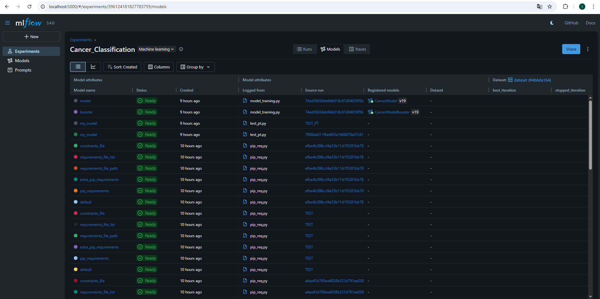
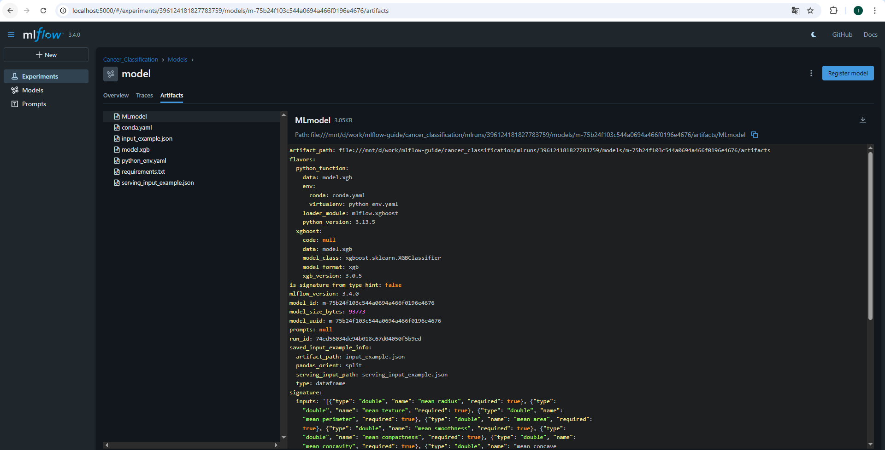
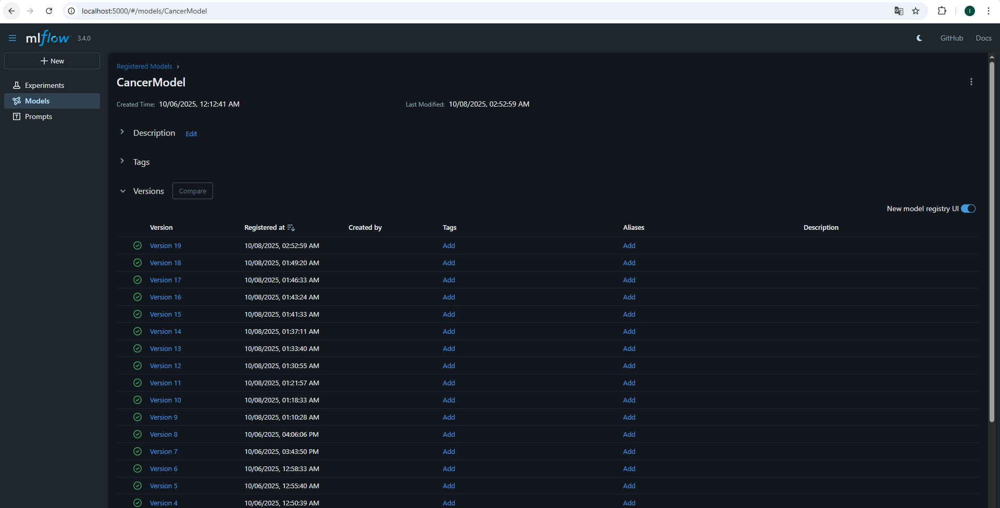
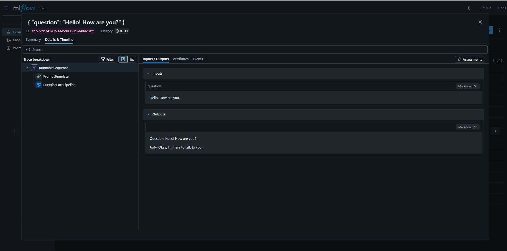
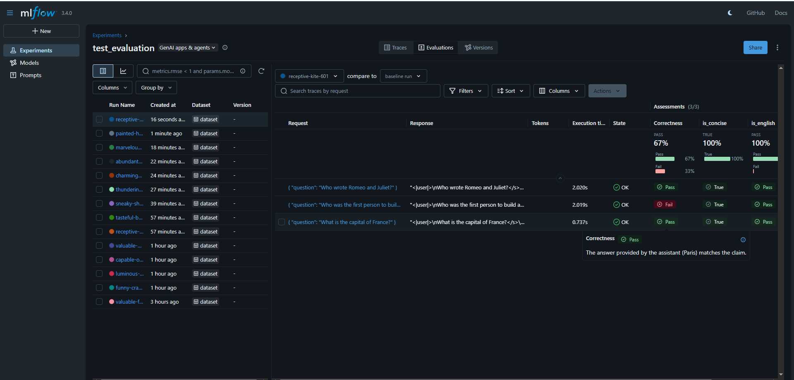
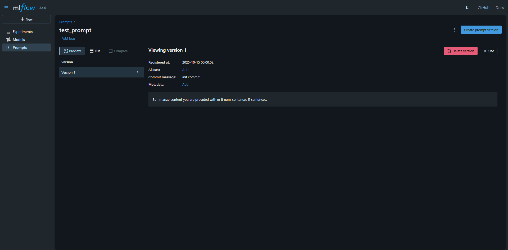
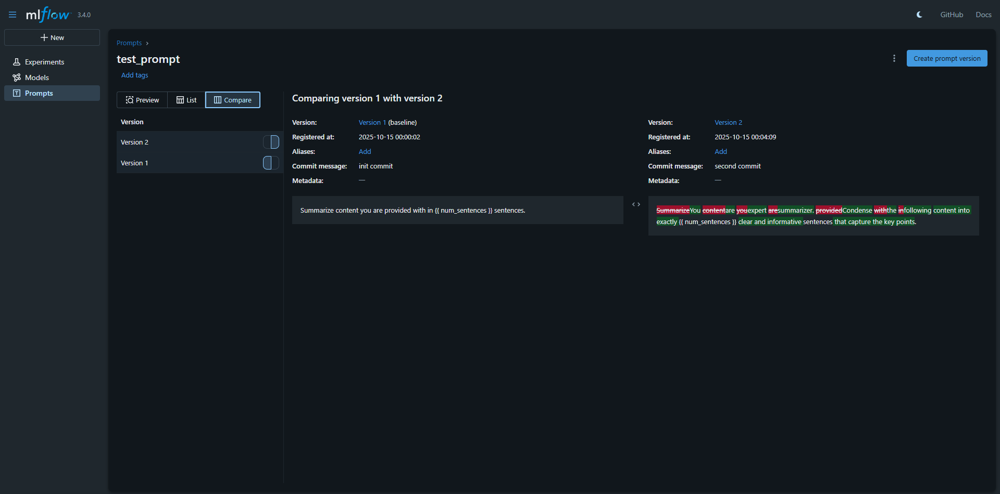
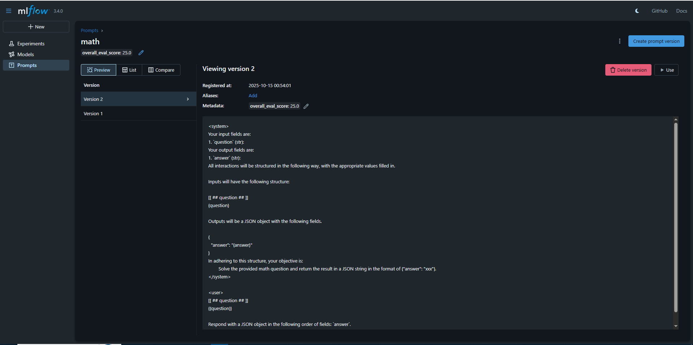

# mlflow-guide

# Инструкция по MLflow

Гайд состоит из двух частей. Первая - базовые функции MLflow - трэкинг разработки моделей. Вторая часть обозревает основные возможности MLflow при внедрении и применении уже обученных моделей в области GenAI.


## Первая часть
В рамках инструкции будут пройдены все основные шаги пайплайна разработки модели в `MLflow` на простом примере с XGBoost моделью на основе open-source датасета из области медицины (классификация онкологии по табличным данным). 
Можно склонировать этот репозиторий и пройти все шаги на своей локальной машине либо просто просмотреть данный README файл.

### Установка и запуск

Для корректной работы всех скриптов нужен python 3.9-3.12 и библиотеки из /cancer_classification/requirements.txt. На момент написания инструкции актуальная версия mlflow - 3.4.0. 
Для установки MLflow в вашем окружении:
```bash
pip install mlflow
```

Для запуска MLflow с одним воркером по умолчанию на localhost:5000 нужно прописать `mlflow ui` в терминале.
Как выглядит страница в браузере:


### Организация проекта

MLflow Project - это подход к структурированию проекта, который упрощает запуск проекта для других разработчиков (или для автоматического запуска). Каждый проект — это директория файлов или git-репозиторий, содержащий код. 
Файл MLproject помогает MLflow и другим пользователям понять и запустить проект, указывая окружение, точки входа и возможные параметры для настройки:

```yaml
name: Cancer_Classification

python_env/docker_env/conda_env: env.yaml

entry_points:
  data-preprocessing:
    parameters:
      test-size: {type: float, default: 0.3}
    command: "python data_preprocessing.py --test-size {test-size}"
  hyperparameters-tuning:
    parameters:
      n-trials: {type: int, default: 10}
    command: "python hyperparameters_tuning.py --n-trials {n-trials}"
  model-training:
    command: "python model_training.py"
  data-evaluation:
    parameters:
      eval-dataset: {type: str}
    command: "python data_evaluation.py --eval-dataset {eval-dataset}"
```

Проекты можно запускать локально, удаленно (через kubernetes, но нужен дополнительный конфигурационный файл), либо через python API:
Локальный запуск с указанием энтри поинта
mlflow run . -e data-preprocessing

Запуск на кубере
mlflow run . --backend kubernetes --backend-config k8s-config.json

Запуск в python
```python
import mlflow
from mlflow.projects import run

result = run(
    uri="https://github.com/mlflow/mlflow-example.git",
    entry_point="main",
    parameters={"alpha": 0.5},
    backend="local",
    synchronous=True,
)
```


### Подготовка данных

На этом шаге загрузим датасет, разделим его на трейн и тест, занесем несколько метрик в MLflow (кол-во примеров и признаков) и добавим сам датасет в артефакты MLflow.
В MLflow работает концепция [runs and experiments](https://mlflow.org/docs/latest/tracking.html). Раны (runs) представляют собой любые запуски data science кода, будь то скрипты по обучению или подготовке данных. При этом в них логируются всевозможные метаданные (метрики, параметры, время выполнения) и артефакты (веса модели, изображения).
Эксперименты представляют собой группу ранов относящихся к одной и той же задаче.


```python
import argparse
import mlflow
import warnings
import pandas as pd
from sklearn.model_selection import train_test_split
from sklearn import datasets
import logging


logging.basicConfig(level=logging.INFO, format="%(asctime)s - %(levelname)s - %(message)s")
warnings.filterwarnings('ignore')


def get_cancer_df():
    cancer = datasets.load_breast_cancer()
    X = pd.DataFrame(cancer.data, columns=cancer.feature_names)
    y = pd.Series(cancer.target)
    logging.info(f'Cancer data downloaded')
    
    return X, y


def main():
    TEST_SIZE = 0.3
    parser = argparse.ArgumentParser()
    parser.add_argument("--test-size", default=TEST_SIZE, type=float)
    TEST_SIZE = parser.parse_args().test_size
        
    logging.info(f'Data preprocessing started with test size: {TEST_SIZE}')
    
    # create or use an experiment
    experiment_id = mlflow.set_experiment('Cancer_Classification').experiment_id
    
    with mlflow.start_run(run_name='Data_Preprocessing'):
            
        # download cancer dataset
        X, y = get_cancer_df()
    
        # add additional features
        X['additional_feature'] = X['mean symmetry'] / X['mean texture']
        logging.info('Additional features added')
    
        # log dataset size and features count
        mlflow.log_metric('full_data_size', X.shape[0])
        mlflow.log_metric('features_count', X.shape[1])
    
        # split dataset to train and test part and log sizes to mlflow
        X_train, X_test, y_train, y_test = train_test_split(X, y, test_size=TEST_SIZE)
        mlflow.log_metric('train_size', X_train.shape[0])
        mlflow.log_metric('test_size', X_test.shape[0])
        
        # log and register datasets
        train = X_train.assign(target=y_train)
        mlflow.log_text(train.to_csv(index=False),'datasets/train.csv')
        dataset_source_link = mlflow.get_artifact_uri('datasets/train.csv')
        dataset = mlflow.data.from_pandas(train, name='train', targets="target", source=dataset_source_link)
        mlflow.log_input(dataset)

        test = X_test.assign(target=y_test)
        mlflow.log_text(test.to_csv(index=False),'datasets/test.csv')
        dataset_source_link = mlflow.get_artifact_uri('datasets/test.csv')
        dataset = mlflow.data.from_pandas(train, name='test', targets="target", source=dataset_source_link)
        mlflow.log_input(dataset)
        
        logging.info('Data preprocessing finished')


if __name__ == '__main__':
    main()
```

2025-10-04 22:58:56,015 - INFO - Data preprocessing started with test size: 0.3
2025/10/04 22:58:56 INFO mlflow.tracking.fluent: Experiment with name 'Cancer_Classification' does not exist. Creating a new experiment.
2025-10-04 22:58:56,551 - INFO - Cancer data downloaded
2025-10-04 22:58:56,557 - INFO - Additional features added
2025-10-04 22:58:57,664 - INFO - Data preprocessing finished


Чтобы выполнить этот код можно сохранить его рядом с файлом MLproject и прописать в командной строке:
mlflow run . --entry-point data-preprocessing --env-manager local --experiment-name Cancer_Classification --run-name Data_Preprocessing -P test-size=0.3

Создастся папка mlruns и теперь этот запуск должен быть доступен через ui. Секция datasets used заполнена благодаря mlflow.data api. Но надо понимать, что это метаданные о данных, а не сами данные. Модуль mlflow.data отслеживает информацию о наборах данных во время обучения и оценки модели: признаки, целевые значения, предсказания, название. Эти метаданные логируются с помощью mlflow.log_input().


### Оптимизация гиперпараметров

В этой части описан подбор лучших гиперпараметров для XGBoost, используя Optuna и встроенную кросс-валидацию для обучения и оценки модели. Кроме того, мы посмотрим, как собирать метрики во время процесса обучения.

```python
# hyperparameters_tuning
import tempfile
import os
import argparse
import logging
import warnings
import mlflow
import optuna
import pandas as pd
import xgboost as xgb
from xgboost.callback import TrainingCallback
import logging


logging.basicConfig(level=logging.INFO, format="%(asctime)s - %(levelname)s - %(message)s")
warnings.filterwarnings('ignore')
logging.getLogger('mlflow').setLevel(logging.ERROR)
optuna.logging.set_verbosity(optuna.logging.ERROR)


# Custom callback for logging metrics
class LoggingCallback(TrainingCallback):
    def after_iteration(self, model, epoch, evals_log):
        for metric_name, metric_vals in evals_log['test'].items():
            mlflow.log_metric(f"{metric_name}", metric_vals[-1][0], step=epoch)
        return False


# Define an objective function for Optuna
def objective(trial):
    global dtrain

    # hyperparameters
    params = {
        "objective": trial.suggest_categorical('objective', ['binary:logistic']),
        "max_depth": trial.suggest_int("max_depth", 2, 8),
        "alpha": trial.suggest_float("alpha", 0.001, 0.05),
        "learning_rate": trial.suggest_float("learning_rate", 0.005, 0.5),
        "num_boost_round": trial.suggest_int("num_boost_round", 30, 300),
    }

    with mlflow.start_run(nested=True):

        mlflow.log_params(params)
        params.update(eval_metric=['auc', 'error'])
        num_boost_round = params["num_boost_round"]
        cv_results = xgb.cv(
            params,
            dtrain,
            num_boost_round=num_boost_round,
            nfold=3,
            callbacks=[LoggingCallback()],
            verbose_eval=False,
        )
        
        error = cv_results['test-error-mean'].iloc[-1]
        mlflow.log_metric("accuracy", (1 - error))
        logging.info(f"Attempt: {trial.number}, Accuracy: {1 - error}")

        return error


if __name__ == '__main__':
    N_TRIALS = 10
    parser = argparse.ArgumentParser()
    parser.add_argument("--n-trials", default=N_TRIALS, type=float)
    N_TRIALS = parser.parse_args().n_trials

    logging.info(f'Hyperparameters tuning started with: {N_TRIALS} trials')

    # start experiment
    experiment_id = mlflow.set_experiment('Cancer_Classification').experiment_id

    with mlflow.start_run(run_name='Hyperparameters_Search', log_system_metrics=True):
        
        # get last finished run for data preprocessing
        last_run_id = mlflow.search_runs(
            experiment_ids=[experiment_id],
            filter_string=f"tags.mlflow.runName = 'Data_Preprocessing' and status = 'FINISHED'",
            order_by=["start_time DESC"]
        ).loc[0, 'run_id']
        
        # download train data from last run
        with tempfile.TemporaryDirectory() as tmpdir:
            path = mlflow.artifacts.download_artifacts(run_id=last_run_id, artifact_path='datasets/train.csv', dst_path=tmpdir)
            train = pd.read_csv(os.path.join(tmpdir, 'train.csv'))
    
        # convert to DMatrix format
        features = [i for i in train.columns if i != 'target']
        dtrain = xgb.DMatrix(data=train.loc[:, features], label=train['target'])
        
        logging.info('Starting optuna study')
        
        study = optuna.create_study(direction='minimize')
        study.optimize(objective, n_trials=N_TRIALS)
        best_trial = study.best_trial
        
        logging.info(f'Optimization finished, best params: {best_trial.params}')
        mlflow.log_params(best_trial.params)
        
        logging.info(f'Best trial Accuracy: {1 - best_trial.value}')
        mlflow.log_metric('accuracy', 1 - study.best_value)


```

2025-10-05 23:40:32,986 - INFO - Hyperparameters tuning started with: 5.0 trials
Downloading artifacts: 100%|████████████████████████████████████████████████████████████████████████████████████████████████████████████████████████████████████████████| 1/1 [00:00<00:00, 113.34it/s]
2025-10-05 23:40:34,127 - INFO - Starting optuna study
2025-10-05 23:40:50,344 - INFO - Attempt: 0, Accuracy: 0.9496848181058708
2025-10-05 23:41:23,431 - INFO - Attempt: 1, Accuracy: 0.9522100706311233
2025-10-05 23:42:17,600 - INFO - Attempt: 2, Accuracy: 0.9496848181058708
2025-10-05 23:42:56,837 - INFO - Attempt: 3, Accuracy: 0.952172096908939
2025-10-05 23:43:48,670 - INFO - Attempt: 4, Accuracy: 0.9497038049669628
2025-10-05 23:43:48,687 - INFO - Optimization finished, best params: {'objective': 'binary:logistic', 'max_depth': 2, 'alpha': 0.008595615173031756, 'learning_rate': 0.31984392956286833, 'num_boost_round': 112}
2025-10-05 23:43:48,736 - INFO - Best trial Accuracy: 0.9522100706311233
2025/10/05 23:43:49 INFO mlflow.projects: === Run (ID '61a9a11e457a4ef28a8f7af08e6f7688') succeeded ===


Запуск:
mlflow run . --entry-point hyperparameters-tuning --env-manager local --experiment-name Cancer_Classification --run-name Hyperparameters_Tuning -P n-trials=5

Есть один основной запуск для настройки гиперпараметров, а все попытки отображаются как вложенные запуски. MLflow также предоставляет возможность настраивать столбцы и порядок строк в этом представлении.
Результаты в MLflow ui:


В сhart view можно сравнить запуски и настроить различные диаграммы. Использование XGBoost callbacks для логирования метрик в процессе обучения модели позволяет создавать подобные графики:


Также можно выбрать несколько запусков, нажать кнопку сравнения и выбрать наиболее полезное представление:


### Логирование и регистрация моделей

Можно сохранять модель для каждого эксперимента и запуска. Здесь мы используем параметры из лучшего запуска для сохранения финальной модели и регистриреум ее для версионирования.


```python
# model_training
import os
import tempfile
import mlflow
import warnings
import logging
import xgboost as xgb
import pandas as pd


# set up logging
warnings.filterwarnings('ignore')
logging.getLogger('mlflow').setLevel(logging.ERROR)


if __name__ == '__main__':

    logging.info('Model training started')
 
    mlflow.xgboost.autolog()

    with mlflow.start_run() as run:

        experiment_id = run.info.experiment_id
        
        run_id = run.info.run_id
        logging.info(f'Start mlflow run: {run_id}')
        
        # get last finished run for data preprocessing
        last_data_run_id = mlflow.search_runs(
            experiment_ids=[experiment_id],
            filter_string=f"tags.mlflow.runName = 'Data_Preprocessing' and status = 'FINISHED'",
            order_by=["start_time DESC"]
        ).loc[0, 'run_id']
    
        # download train and test data from last run
        with tempfile.TemporaryDirectory() as tmpdir:
            mlflow.artifacts.download_artifacts(run_id=last_data_run_id, artifact_path='datasets/train.csv', dst_path=tmpdir)
            mlflow.artifacts.download_artifacts(run_id=last_data_run_id, artifact_path='datasets/test.csv', dst_path=tmpdir)
            train = pd.read_csv(os.path.join(tmpdir, 'train.csv'))
            test = pd.read_csv(os.path.join(tmpdir, 'test.csv'))

        # convert to DMatrix format
        features = [i for i in train.columns if i != 'target']
        dtrain = xgb.DMatrix(data=train.loc[:, features], label=train['target'])
        dtest = xgb.DMatrix(data=test.loc[:, features], label=test['target'])

        # get last finished run for hyperparameters tuning
        last_tuning_run = mlflow.search_runs(
            experiment_ids=[experiment_id],
            filter_string=f"tags.mlflow.runName = 'Hyperparameters_Tuning' and status = 'FINISHED'",
            order_by=["start_time DESC"]
        ).loc[0, :]
        
        # get best params
        params = {col.split('.')[1]: last_tuning_run[col] for col in last_tuning_run.index if 'params' in col}
        params.update(eval_metric=['auc', 'error'])

        mlflow.log_params(params)
        
        model = xgb.train(
            dtrain=dtrain,
            num_boost_round=int(params["num_boost_round"]),
            params=params,
            evals=[(dtest, 'test')],
            verbose_eval=False,
            early_stopping_rounds=10
        )

        mlflow.log_metric("accuracy", 1 - model.best_score)
        
        # Log model as Booster
        input_example = test.loc[0:10, features]
        predictions_example = pd.DataFrame(model.predict(xgb.DMatrix(input_example)), columns=['predictions'])
        mlflow.xgboost.log_model(model, "booster", input_example=input_example)
        mlflow.log_text(predictions_example.to_json(orient='split', index=False), 'booster/predictions_example.json')

        # Register model
        model_uri = f"runs:/{run.info.run_id}/booster"
        mlflow.register_model(model_uri, 'CancerModelBooster')
        
        # Log model as sklearn completable XGBClassifier
        params.update(num_boost_round=model.best_iteration)
        model = xgb.XGBClassifier(**params)
        model.fit(train.loc[:, features], train['target'])
        mlflow.xgboost.log_model(model, "model", input_example=input_example)

        # log datasets
        mlflow.log_text(train.to_csv(index=False), 'datasets/train.csv')
        mlflow.log_text(test.to_csv(index=False),'datasets/test.csv')

        logging.info('Model training finished')

        # Register the model
        model_uri = f"runs:/{run.info.run_id}/model"
        mlflow.register_model(model_uri, 'CancerModel')
        
        logging.info('Model registered')

```

mlflow run . --entry-point model-training --env-manager local --experiment-name Cancer_Classification --run-name Model_Training -P n-trials=5

Благодаря функции mlflow.xgboost.autolog(), все метрики автоматически логируются, в том числе в процессе обучения:


После сохранения модели, мы можем получить доступ к странице артефактов внутри запуска. В артефактах можно хранить любые типы файлов, такие как пользовательские графики, текстовые файлы, изображения, наборы данных или скрипты Python. Для того чтобы добавить в артефакты pytorch модель нужно использовать mlflow.pytorch.log_model().
Все артефакты (кроме модели) будут доступны в разделе artifacts внутри запуска. Артефакты модели вынесены в отдельную вкладку Models внутри эксперимента, туда попадают все модели с ваших запусков (занесенные с помощью log_model()):


Также можно попасть на страницу с артефактами модели через столбец models у запуска в котором была залогирована модель. Страница с артефактами модели:



Помимо самого файла модели (это может быть формат *.xgb, *.pt, *.pth и тд, в зависимости от фреймворка) и файлов окружения, для каждой модели MLflow автоматически создаёт YAML конфигурационный файл, называемый MLmodel. Этот файл можно просмотреть в интерфейсе MLflow или скачать и изучить.

```yaml
artifact_path: file:///mnt/d/work/mlflow-guide/cancer_classification/mlruns/396124181827783759/models/m-75b24f103c544a0694a466f0196e4676/artifacts
flavors:
  python_function:
    data: model.xgb
    env:
      conda: conda.yaml
      virtualenv: python_env.yaml
    loader_module: mlflow.xgboost
    python_version: 3.13.5
  xgboost:
    code: null
    data: model.xgb
    model_class: xgboost.sklearn.XGBClassifier
    model_format: xgb
    xgb_version: 2.0.3
is_signature_from_type_hint: false
mlflow_version: 3.4.0
model_id: m-75b24f103c544a0694a466f0196e4676
model_size_bytes: 93773
model_uuid: m-75b24f103c544a0694a466f0196e4676
prompts: null
run_id: 74ed56034de94b018c67d04050f5b9ed
saved_input_example_info:
  artifact_path: input_example.json
  pandas_orient: split
  serving_input_path: serving_input_example.json
  type: dataframe
signature:
  inputs: '[{"type": "double", "name": "mean radius", "required": true}, {"type":
    "double", "name": "mean texture", "required": true}, {"type": "double", "name":
    "mean perimeter", "required": true}, {"type": "double", "name": "mean area", "required":
    true}, {"type": "double", "name": "mean smoothness", "required": true}, {"type":
    "double", "name": "mean compactness", "required": true}, {"type": "double", "name":
    "mean concavity", "required": true}, {"type": "double", "name": "mean concave
    points", "required": true}, {"type": "double", "name": "mean symmetry", "required":
    true}, {"type": "double", "name": "mean fractal dimension", "required": true},
    {"type": "double", "name": "radius error", "required": true}, {"type": "double",
    "name": "texture error", "required": true}, {"type": "double", "name": "perimeter
    error", "required": true}, {"type": "double", "name": "area error", "required":
    true}, {"type": "double", "name": "smoothness error", "required": true}, {"type":
    "double", "name": "compactness error", "required": true}, {"type": "double", "name":
    "concavity error", "required": true}, {"type": "double", "name": "concave points
    error", "required": true}, {"type": "double", "name": "symmetry error", "required":
    true}, {"type": "double", "name": "fractal dimension error", "required": true},
    {"type": "double", "name": "worst radius", "required": true}, {"type": "double",
    "name": "worst texture", "required": true}, {"type": "double", "name": "worst
    perimeter", "required": true}, {"type": "double", "name": "worst area", "required":
    true}, {"type": "double", "name": "worst smoothness", "required": true}, {"type":
    "double", "name": "worst compactness", "required": true}, {"type": "double", "name":
    "worst concavity", "required": true}, {"type": "double", "name": "worst concave
    points", "required": true}, {"type": "double", "name": "worst symmetry", "required":
    true}, {"type": "double", "name": "worst fractal dimension", "required": true},
    {"type": "double", "name": "additional_feature", "required": true}]'
  outputs: '[{"type": "long", "required": true}]'
  params: null
type_hint_from_example: false
utc_time_created: '2025-10-07 23:52:48.989140'

```

Файл MLmodel содержит информацию по оберткам (flavors), здесь это pyfunc и xgboost. Из файла видно, что модель является классификатором XGBoost, совместимым с API sklearn, сохранённым в формате XGBoost версии 2.0.3. Файл отслеживает такие детали, как размер модели, UUID, run ID и время создания. Также есть пример входных данных.

Flavors это ключевая концепция в MLflow Models. Они представляют собой соглашение, которое инструменты развертывания (или разработчики) могут использовать для понимания модели. Это позволяет создавать инструменты, совместимые с моделями из любых библиотек машинного обучения, без необходимости интегрировать каждый инструмент с каждой библиотекой. MLflow определяет несколько «стандартных» вариантов, которые поддерживаются всеми его встроенными инструментами развертывания, например, «Python function» (функция на Python), описывающий, как запускать модель в виде функции на Python.

Было сохранено две версии модели, обе с использованием xgboost, каждая из которых имеет два "flavors": python_function и xgboost. Разница заключается в классе модели: для бустера это xgboost.core.Booster, а для модели это xgboost.sklearn.XGBClassifier, который поддерживает API, совместимый с scikit-learn. Эти различия влияют на работу метода predict, поэтому важно просмотреть файл MLmodel и проверить сигнатуру модели перед использованием. Также могут быть небольшие различия в производительности, так как python_function обычно немного медленее.

Также можно регистрировать модели с помощью mlflow.register_model(), проставлять для них теги и описание. После этого модели попадают в models registry. Модели с одинаковым именем будут версионироваться. При выборе определенной версии модели можно перейти на соответствующий ран, в котором была получена эта модель, и перейти к ее артефактам.



### Оценка работы модели

Встроенная функция mlflow.evaluate позволяет оценивать модели на дополнительных наборах данных:

```python
# data_evaluation
import argparse
import warnings
import logging
import mlflow
import pandas as pd
import logging


logging.basicConfig(level=logging.INFO, format="%(asctime)s - %(levelname)s - %(message)s")
warnings.filterwarnings('ignore')
logging.getLogger('mlflow').setLevel(logging.ERROR)


if __name__ == '__main__':

    logging.info('Evaluation started')

    parser = argparse.ArgumentParser()
    parser.add_argument("--eval-dataset", type=str)
    eval_dataset = pd.read_csv(parser.parse_args().eval_dataset)
        
    with mlflow.start_run() as run:
        
        eval_dataset = mlflow.data.from_pandas(
            eval_dataset, targets="target"
        )
        last_version = mlflow.MlflowClient().get_registered_model('CancerModel').latest_versions[0].version
        mlflow.evaluate(
            data=eval_dataset, model_type="classifier", model=f'models:/CancerModel/{last_version}'
        )
        logging.info('Evaluation finished')

```

mlflow run . --entry-point data-evaluation --env-manager local --experiment-name Cancer_Classification --run-name Data_Evaluation -P eval-dataset='/path/to/test.csv'

Результаты можно просмотреть в интерфейсе MLflow, где представлены различные метрики и графики, матрицы ошибок.


### Деплой модели

MLflow имеет встроенные возможности для деплоя моделей. Деплой можно разделить на 2 вида: mlflow models для локального запуска и mlflow deployments для запуска другими способами (kubernetes, databricks). 
Деплой модели с использованием Flask: 
mlflow models serve -m models:/CancerModel/1 --env-manager local -p 5001
Отправка реквеста на сервер:
curl http://127.0.0.1:5001/invocations -H "Content-Type:application/json"  --data '{"inputs": [[1, 2], [3, 4], [5, 6]]}'

Также можно настроить деплой с помощью пакета mlserver. Он облегчает развертывание моделей машинного обучения с поддержкой множества фреймворков, используя интерфейсы REST и gRPC. Потребуется установить следующие пакеты: mlserver, mlserver-mlflow если используется собственное окружение. После этого нужно настроить конфигурационный файл (model-settings.json) для MLServer.

```json
{
    "name": "cancer-model",
    "implementation": "mlserver_mlflow.MLflowRuntime",
    "parameters": {
        "uri": "models:/CancerModel/1"
    }
}
```

Чтобы запустить MLServer в локальном окружении, можно использовать команду 
mlserver start .
Теперь у нас есть рабочий API с документацией OpenAPI, валидацией запросов, HTTP и gRPC серверами и эндпоинтом с метриками для prometheus.
Мы можем проверить документацию для нашей модели и изучить ожидаемую структуру данных через Swagger по адресу /v2/models/cancer/model/docs


### TODO
Развертывание сервера
По умолчанию все запуски хранятся локально в файловой системе. Для работы в команде это не подходит, нужно развернуть отдельный сервер.


## Вторая часть

В обновлении MLflow 3.0 был добавлен модуль GenAI Apps & Agents, который позволяет разрабатывать, оценивать, развертывать и отслеживать работу GenAI моделей.
Основные возможности:
 1. Tracing (улучшает прозрачность, фиксируя входные данные, выходные результаты и метаданные, связанные с каждым промежуточным шагом);
 2. Evaluation (оценка качества работы модели);
 3. Prompt Registry (регистрация промптов, их оптимизация);


### Tracing
Для работы данного функционала необходимо подключение backend storage в виде базы данных. Локально самое простое сделать так:
mlflow ui --backend-store-uri sqlite:///mlflow.db --port 5000
MLflow Tracing интегрирован с различными библиотеками GenAI и обеспечивает автоматическое отслеживание в один клик для таких библиотек как OpenAI, LangChain, Claude, Deepseek и т.д. 
Пример автологирования для LangChain:

```python
import mlflow

from langchain.prompts import PromptTemplate
from langchain_huggingface.llms import HuggingFacePipeline


# Создание объекта модели на базе Hugging Face
hf = HuggingFacePipeline.from_model_id(
    model_id="gpt2",
    task="text-generation",
    pipeline_kwargs={"max_new_tokens": 15},
)

# Включение автологирования
mlflow.langchain.autolog()

mlflow.set_tracking_uri("http://localhost:5000")
mlflow.set_experiment("LangChain")

prompt_template = PromptTemplate.from_template(
    """Question: {question}"""
)

chain = prompt_template | hf

print(chain.invoke(
    {
        "question": "Hello! How are you?"
    }
))
```

В интерфейсе в разделе Traces появится строка, в ней можно посмотреть вход и выход, аттрибуты модели и скорость выполнения каждого шага.


Также можно добавлять пользовательские traces с помощью декоратора mlflow.trace(). При использовании его с другими декораторами, для правильной работы он должен быть внешним. Декоратор принимает следующие аргументы для настройки создаваемого спана:
name — параметр для переопределения имени спана, по умолчанию это имя декорируемой функции;
span_type — параметр для задания типа спана (например: 'func', 'retriever', 'reranker' и тд). Можно установить один из встроенных типов спанов или строку;
attributes — параметр для добавления пользовательских атрибутов к спану;

Также traces могут быть использованы для того чтобы отслеживать сколько токенов было использовано для обработки запроса и генерации ответа, отслеживать запросы конкретных пользователей или сессий, версии приложений и окружение. Можно транслировать запросы с прода в traces и отсматривать их на предмет ошибок.

С помощью MLflow Feedback API можно проставлять пользовательские оценки каждому запросу. Фидбэк может быть бинарным (ок/не ок), числовым (1-5) или текстовым.


### Evaluation
Mlflow.genai предлагает подход для построения последовательного процесса оценки качества GenAI моделей. Он стандартизирует взаимодействие между датасетами, моделями, ментриками и предоставляет фреймворк для отслеживания и сравнения результатов.
Модуль основывается на трех основных концепциях:
Функция предсказания (prediction function) - отвечает за генерацию результатов на основе заданных входных данных;
Функция оценки (scorer) - определяет критерий качества ответа. Может отвечать на вопрос насколько правильны или корректны с точки зрения формата выходные данные модели;
Тестовый датасет (evaluation dataset) - состоит из входных данных (обязательно), и ожидаемого результата (опционально);

Пример простого пайплайна для оценки работы модели:
```python
import mlflow
import os

from mlflow.genai import scorer
from mlflow.genai.scorers import Correctness, Guidelines

from transformers import pipeline


os.environ["MISTRAL_API_KEY"] = ""

mlflow.set_tracking_uri("http://localhost:5000")
mlflow.set_experiment("test_evaluation")

# Создание объекта модели
pipe = pipeline("text-generation", model="TinyLlama/TinyLlama-1.1B-Chat-v1.0")


# Функция предсказания
def qa_predict_fn(question: str) -> str:
    messages = [{"role": "user", "content": question}]
    prompt = pipe.tokenizer.apply_chat_template(messages, tokenize=False, add_generation_prompt=True)
    outputs = pipe(prompt, max_new_tokens=20)
    response = outputs[0]["generated_text"]

    return response


# Простой Q&A датасет с вопросами и ожидаемыми ответами
evaluation_dataset = [
    {
        "inputs": {"question": "What is the capital of France?"},
        "expectations": {"expected_response": "Paris"},
    },
    {
        "inputs": {"question": "Who was the first person to build an airplane?"},
        "expectations": {"expected_response": "Wright Brothers"},
    },
    {
        "inputs": {"question": "Who wrote Romeo and Juliet?"},
        "expectations": {"expected_response": "William Shakespeare"},
    },
]


# Определение функций оценки
@scorer
def is_concise(outputs: str) -> bool:
    """Evaluate if the answer is concise (less than 30 words)"""
    return len(outputs.split()) <= 30


scorers = [
    Correctness(model="mistral:/mistral-tiny"),
    Guidelines(name="is_english", guidelines="The answer must be in English", model="mistral:/mistral-tiny"),
    is_concise,
]

# Запуск
results = mlflow.genai.evaluate(
    data=evaluation_dataset,
    predict_fn=qa_predict_fn,
    scorers=scorers,
)

```



В MLflow есть встроенные функции оценки такие как Correctness или Guidelines, которые используют сторонние LLM для оценки правильности ответа. Но также можно добавлять функции оценки самому (через декоратора @scorer()), например для отслеживания корректности формата выходного сообщения или для контроля количества токенов.


### Prompt registry
MLflow Prompt Registry позволяет отслеживать, версионировать и переиспользовать промпты внутри команды разработки.
Зарегистрировать промпт в реестре MLflow можно двумя основными способами: через интерфейс MLflow или с помощью Python.
В интерфейсе через New->Prompt нужно ввести название, контент и сообщение коммита для нового промпта.


Изменяя данный промпт можно получать новые версии и сравнивать их в интерфейсе:


Регистрация промптов через python:
```python
initial_template = """
Summarize content you are provided with in {{ num_sentences }} sentences
"""
# Register a new prompt
prompt = mlflow.genai.register_prompt(
    name="summarization-prompt",
    template=initial_template,
    # Optional: Provide a commit message to describe the changes
    commit_message="Initial commit",
    # Optional: Set tags applies to the prompt (across versions)
    tags={
        "author": "author@example.com",
        "task": "summarization",
        "language": "en",
    },
)
```

После этого его можно подгрузить из реестра с помощью mlflow.genai.load_prompt("prompts:/test_prompt/2")
Для того, чтобы оптимизировать промпт нужно несколько составляющих: зарегистрированный промпт, функция оценки, train и val датасет, llm модель и настройки оптимизации (OptimizerConfig).
Пример оптимизации промпта отвечающего на вопросы:

```python
import os
from typing import Any
import mlflow
from mlflow.genai.scorers import scorer
from mlflow.genai.optimize import OptimizerConfig, LLMParams


# os.environ["MISTRAL_API_KEY"] = ""
mlflow.set_tracking_uri("http://localhost:5000")


# Define a custom scorer function to evaluate prompt performance with the @scorer decorator.
# The scorer function for optimization can take inputs, outputs, and expectations arguments, but not the trace argument.
# Note that the DSPy/MIPROv2 optimizer requires metrics to receive outputs as a dict.
@scorer
def exact_match(expectations: dict[str, Any], outputs: dict[str, Any]) -> bool:
    return expectations["answer"] == outputs["answer"]


# Register the initial prompt
initial_template = """
Answer to this math question: {{question}}.
Return the result in a JSON string in the format of {"answer": "xxx"}.
"""

prompt = mlflow.genai.register_prompt(
    name="math",
    template=initial_template
)

# The data can be a list of dictionaries, a pandas DataFrame, or an mlflow.genai.EvaluationDataset
# It needs to contain inputs and expectations where each row is a dictionary.
train_data = [
    {
        "inputs": {"question": "Given that $y=3$, evaluate $(1+y)^y$."},
        "expectations": {"answer": "64"},
    },
    {
        "inputs": {
            "question": "The midpoint of the line segment between $(x,y)$ and $(-9,1)$ is $(3,-5)$. Find $(x,y)$."
        },
        "expectations": {"answer": "(15,-11)"},
    },
    {
        "inputs": {
            "question": "What is the value of $b$ if $5^b + 5^b + 5^b + 5^b + 5^b = 625^{(b-1)}$? Express your answer as a common fraction."
        },
        "expectations": {"answer": "\\frac{5}{3}"},
    },
    {
        "inputs": {"question": "Evaluate the expression $a^3\\cdot a^2$ if $a= 5$."},
        "expectations": {"answer": "3125"},
    },
    {
        "inputs": {"question": "Evaluate $\\lceil 8.8 \\rceil+\\lceil -8.8 \\rceil$."},
        "expectations": {"answer": "17"},
    },
]

eval_data = [
    {
        "inputs": {
            "question": "The sum of 27 consecutive positive integers is $3^7$. What is their median?"
        },
        "expectations": {"answer": "81"},
    },
    {
        "inputs": {"question": "What is the value of $x$ if $x^2 - 10x + 25 = 0$?"},
        "expectations": {"answer": "5"},
    },
    {
        "inputs": {
            "question": "If $a\\ast b = 2a+5b-ab$, what is the value of $3\\ast10$?"
        },
        "expectations": {"answer": "26"},
    },
    {
        "inputs": {
            "question": "Given that $-4$ is a solution to $x^2 + bx -36 = 0$, what is the value of $b$?"
        },
        "expectations": {"answer": "-5"},
    },
]

# Optimize the prompt
result = mlflow.genai.optimize_prompt(
    target_llm_params=LLMParams(model_name="mistral:/mistral-tiny"),
    prompt=prompt,
    train_data=train_data,
    eval_data=eval_data,
    scorers=[exact_match],
    optimizer_config=OptimizerConfig(
        num_instruction_candidates=8,
        max_few_show_examples=2,
    ),
)
```
В интерфейсе можно посмотреть на оптимизированную версию промпта:

